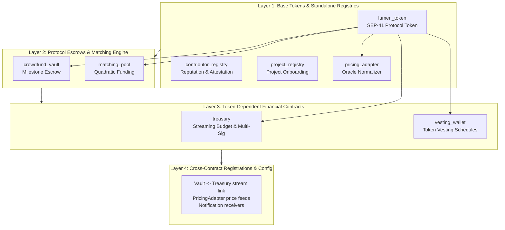
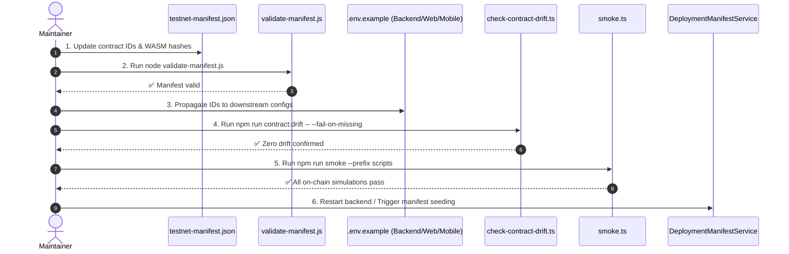
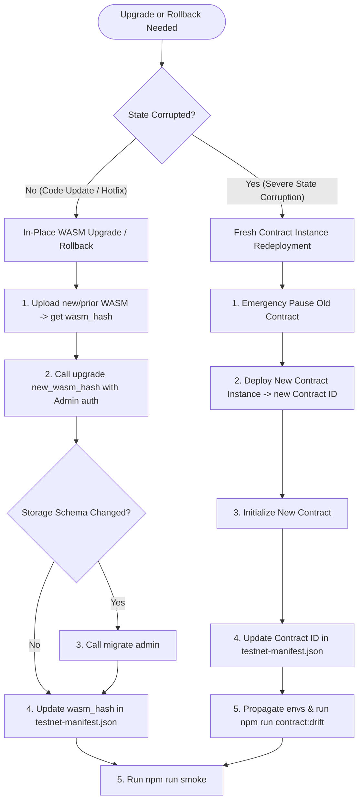
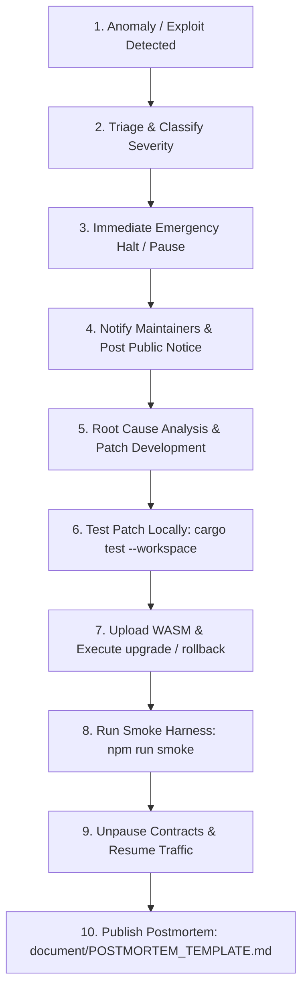

# Soroban Contract Deployment & Rollback Playbook

**Version**: 1.0.0  
**Target Networks**: Stellar Testnet (`https://soroban-testnet.stellar.org:443`), Local Standalone Sandbox, Stellar Mainnet (Future)  
**Audience**: Maintainers, Smart Contract Engineers, DevOps, Platform Integrators, and Open-Source Contributors  
**Canonical Manifest**: [`apps/onchain/testnet-manifest.json`](../apps/onchain/testnet-manifest.json)  
**Smart Contract Sources**: [`apps/onchain/contracts/`](../apps/onchain/contracts/)

---

## 1. Executive Summary & Purpose

The Lumenpulse protocol relies on a modular suite of Soroban smart contracts built in Rust on the Stellar blockchain. These contracts handle core decentralized capabilities including protocol token distribution, milestone escrow vaults, quadratic funding matching pools, reputation tracking, streaming treasury allocations, and price normalizations.

This playbook provides an authoritative, step-by-step operational guide for:
1. **Pre-Deployment & Environment Setup**: Toolchains, keys, network parameters, and funding.
2. **Deterministic Topological Deployment**: Contract ordering, cross-contract dependencies, and initialization sequences.
3. **Canonical Manifest Handling**: Maintaining `apps/onchain/testnet-manifest.json`, schema rules, validation scripts, and downstream drift prevention.
4. **Post-Deployment Verification**: Read-only simulation smoke tests and backend integration seeding.
5. **Contract Upgrades & Rollbacks**: In-place WASM upgrades (`upgrade`), schema migrations (`migrate`), fast bytecode rollbacks, and clean-instance redeployments.
6. **Emergency Halt & Circuit Breakers**: Protocol-wide and contract-level pause functions, streaming cancellations, attestation suspensions, account freezing, and disaster recovery workflows.

---

## 2. Prerequisites & Environment Configuration

### 2.1 Required Toolchains & Versions

Before running deployment or verification routines, ensure the following developer tools are installed and available in your environment `PATH`:

| Tool | Minimum Version | Installation / Verification Command | Purpose |
|---|---|---|---|
| **Rust** | `1.75+` (stable) | `rustc --version` | Contract compilation |
| **WASM Target** | `wasm32-unknown-unknown` | `rustup target add wasm32-unknown-unknown` | Target architecture for Soroban bytecode |
| **Soroban / Stellar CLI** | `v23+` | `soroban --version` or `stellar --version` | Contract upload, deployment, and direct invocation |
| **Node.js** | `18.0.0+` (LTS recommended) | `node --version` | Deployment scripts, manifest validation, drift checks |
| **TypeScript / ts-node** | `10.9+` | `npx ts-node --version` | Automated deployment runner execution |

### 2.2 Network Parameters

| Parameter | Testnet Default Value | Local Standalone Value | Mainnet (Target) |
|---|---|---|---|
| **Network Passphrase** | `Test SDF Network ; September 2015` | `Standalone Network ; February 2017` | `Public Global Stellar Network ; September 2015` |
| **Soroban RPC URL** | `https://soroban-testnet.stellar.org:443` | `http://localhost:8000/soroban/rpc` | `https://soroban-rpc.mainnet.stellar.org` |
| **Horizon API URL** | `https://horizon-testnet.stellar.org` | `http://localhost:8000` | `https://horizon.stellar.org` |
| **Friendbot URL** | `https://friendbot.stellar.org` | `http://localhost:8000/friendbot` | N/A (Fund with real XLM) |

### 2.3 Account Setup & Faucet Funding

Deployment requires an administrative keypair with sufficient XLM to cover transaction submission fees, WASM upload storage fees, and initial contract ledger footings / TTL reservations.

1. **Generate or export an Admin Keypair**:
   ```bash
   # Using Soroban CLI
   soroban keys generate testnet-admin --network testnet
   export ADMIN_SECRET=$(soroban keys show testnet-admin)
   export ADMIN_PUBLIC_KEY=$(soroban keys address testnet-admin)
   ```

2. **Fund the Admin Account on Testnet**:
   ```bash
   curl "https://friendbot.stellar.org?addr=${ADMIN_PUBLIC_KEY}"
   ```

3. **Verify Account Balance**:
   ```bash
   curl -s "https://horizon-testnet.stellar.org/accounts/${ADMIN_PUBLIC_KEY}" | grep -o '"balance":"[^"]*"'
   ```
   > [!IMPORTANT]
   > Ensure the admin account holds at least **100 XLM** prior to deploying the full contract suite. WASM uploads and contract instance creations require substantial transaction footprints and initial TTL ledger rent.

### 2.4 Environment Variables Matrix

Configure your local `.env` or deployment runtime environment variables:

| Variable | Location | Description | Example |
|---|---|---|---|
| `ADMIN_SECRET` | `scripts/.env` | Secret seed (`S...`) of deployer / admin keypair | `SA...` |
| `SOROBAN_RPC_URL` | Monorepo root / `scripts/.env` | Soroban RPC endpoint | `https://soroban-testnet.stellar.org:443` |
| `HORIZON_URL` | `scripts/.env` | Stellar Horizon REST endpoint | `https://horizon-testnet.stellar.org` |
| `NETWORK_PASSPHRASE` | `scripts/.env` | Stellar network passphrase | `Test SDF Network ; September 2015` |
| `SMOKE_MANIFEST` | `scripts/.env` (optional) | Path override to canonical manifest | `../apps/onchain/testnet-manifest.json` |
| `SMOKE_ADMIN` | `scripts/.env` (optional) | Public key for smoke simulation caller | `GDPBZZDKZJTPFERPP...` |

---

## 3. Contract Suite Inventory & Dependency Ordering

### 3.1 Complete Contract Inventory

The Lumenpulse on-chain repository (`apps/onchain/contracts/`) contains active protocol members, utility contracts, and deferred crates. All active contracts are accounted for in the canonical manifest:



| Crate Name | Contract Identifier | Purpose | Direct Dependencies at Init |
|---|---|---|---|
| `lumen_token` | `CDAQQ...` | Protocol governance and reward token (SEP-41 compliant) | None (`admin`, `decimal`, `name`, `symbol`) |
| `contributor_registry` | `CCOVD...` | Developer and contributor reputation, badges, and attestations | None (`admin` or `admin`, `initial_rep`, `multisig_config`) |
| `project_registry` | `CBYFZ...` | Project lifecycle metadata, verification, and community voting | None (`admin`, `voter_threshold`, `vote_window`) |
| `pricing_adapter` | `CCW2E...` | Oracle price adapter normalizing asset prices to standard decimals | None (`admin`) |
| `crowdfund_vault` | `CBBQW...` | Milestone-based crowdfunding escrow with quadratic funding hooks and clawbacks | None at init (`admin`); references token at runtime |
| `matching_pool` | `CBQJ2...` | Quadratic funding pool matching allocation and distribution engine | None at init (`admin`); references token at runtime |
| `treasury` | `CB6FR...` | Streaming budget disbursement, cliffs, and multi-sig operations | **Requires `lumen_token` Address** (`admin`, `token`) |
| `vesting_wallet` | `(Deferred / Staged)` | Linear and cliff-based token vesting schedules | **Requires `lumen_token` Address** (`admin`, `token`) |
| `yield_vault` | `(Deferred)` | Multi-provider yield routing (Aave/Compound adapters) | Deferred for future treasury phase |
| `feature_flags` | `(Off-chain)` | Fast flag toggles | Kept off-chain in initial release |
| `upgradable_contract` | `(Template)` | Reference timelock and 2-step admin upgrade implementation | Standalone template |

### 3.2 Strict Topological Deployment Order

Deployments **MUST** strictly follow the dependency layers below. Violating this order will cause initialization panics (e.g. attempting to initialize `treasury` before `lumen_token` is deployed):

1. **Phase 1 (Base Foundation)**:
   - Deploy `lumen_token` and call `initialize(admin, 7, "LumenToken", "LUMEN")`.
   - Deploy `contributor_registry` and call `initialize(admin)`.
   - Deploy `project_registry` and call `initialize(admin, threshold, window)`.
   - Deploy `pricing_adapter` and call `initialize(admin)`.
2. **Phase 2 (Core Protocol Services)**:
   - Deploy `crowdfund_vault` and call `initialize(admin)`.
   - Deploy `matching_pool` and call `initialize(admin)`.
3. **Phase 3 (Token-Dependent Financial Infrastructure)**:
   - Deploy `treasury` and call `initialize(admin, token_address)` using the `lumen_token` contract address from Phase 1.
   - Deploy `vesting_wallet` and call `initialize(admin, token_address)` using the `lumen_token` contract address from Phase 1.
4. **Phase 4 (Inter-Contract Linkage & Post-Init Configuration)**:
   - Configure initial price feeds in `pricing_adapter` (`set_price`).
   - Register notification listeners or streaming treasury destinations in `crowdfund_vault`.

---

## 4. Step-by-Step Deployment Procedure

### 4.1 Step 1: Build and Optimize WASM Binaries

Compile all workspace contracts in release mode targeting WebAssembly:

```bash
# From workspace root
cd apps/onchain
cargo build --target wasm32-unknown-unknown --release
```

Verify WASM sizes against configured budgets in [`apps/onchain/wasm-budgets.json`](../apps/onchain/wasm-budgets.json):

```bash
# Run size budget verifier
node ../../scripts/check-wasm-size.mjs
```

Ensure all generated binaries exist under `apps/onchain/target/wasm32-unknown-unknown/release/`:
- `lumen_token.wasm`
- `contributor_registry.wasm`
- `project_registry.wasm`
- `crowdfund_vault.wasm`
- `matching_pool.wasm`
- `treasury.wasm`
- `pricing_adapter.wasm`

### 4.2 Step 2: Automated Deployment via TypeScript Runner

The repository provides an automated, dependency-aware deployment runner in [`scripts/deploy.ts`](../scripts/deploy.ts) configured by [`scripts/contracts.config.ts`](../scripts/contracts.config.ts).

1. **Install script dependencies**:
   ```bash
   npm install --prefix scripts
   ```

2. **Configure environment**:
   Create or update `scripts/.env`:
   ```env
   ADMIN_SECRET=SA...
   SOROBAN_RPC_URL=https://soroban-testnet.stellar.org:443
   HORIZON_URL=https://horizon-testnet.stellar.org
   NETWORK_PASSPHRASE=Test SDF Network ; September 2015
   ```

3. **Execute the deployment script**:
   ```bash
   npx ts-node scripts/deploy.ts
   ```

   The script automatically:
   - Reads compiled WASM binaries.
   - Uploads WASM bytecode to Soroban RPC (or falls back to signed Horizon transactions).
   - Computes deterministic SHA-256 WASM hashes.
   - Instantiates each contract.
   - Passes previously deployed contract addresses (such as `token`) to subsequent initializers (such as `vesting_wallet` and `treasury`).
   - Outputs the resulting contract IDs to `scripts/contract-ids.json`.

### 4.3 Step 3: Manual CLI Deployment Fallback

If running manual deployments via the Soroban CLI:

```bash
# 1. Upload WASM bytecode
TOKEN_WASM_HASH=$(soroban contract install \
  --wasm apps/onchain/target/wasm32-unknown-unknown/release/lumen_token.wasm \
  --source testnet-admin \
  --network testnet)

# 2. Deploy Contract Instance
TOKEN_CONTRACT_ID=$(soroban contract deploy \
  --wasm-hash $TOKEN_WASM_HASH \
  --source testnet-admin \
  --network testnet)

# 3. Initialize Contract
soroban contract invoke \
  --id $TOKEN_CONTRACT_ID \
  --source testnet-admin \
  --network testnet \
  -- \
  initialize \
  --admin $ADMIN_PUBLIC_KEY \
  --decimal 7 \
  --name "LumenToken" \
  --symbol "LUMEN"

# 4. Deploy and Initialize Treasury with Token Address
TREASURY_WASM_HASH=$(soroban contract install \
  --wasm apps/onchain/target/wasm32-unknown-unknown/release/treasury.wasm \
  --source testnet-admin \
  --network testnet)

TREASURY_CONTRACT_ID=$(soroban contract deploy \
  --wasm-hash $TREASURY_WASM_HASH \
  --source testnet-admin \
  --network testnet)

soroban contract invoke \
  --id $TREASURY_CONTRACT_ID \
  --source testnet-admin \
  --network testnet \
  -- \
  initialize \
  --admin $ADMIN_PUBLIC_KEY \
  --token $TOKEN_CONTRACT_ID
```

---

## 5. Canonical Manifest Management & Synchronization

### 5.1 Manifest Schema Architecture

The canonical source of truth for all active testnet contracts is [`apps/onchain/testnet-manifest.json`](../apps/onchain/testnet-manifest.json).

```json
{
  "network": "testnet",
  "rpc_url": "https://soroban-testnet.stellar.org:443",
  "admin_address": "GDPBZZDKZJTPFERPP65ATQWH2T6OIXQESPKXSTO6YY33TA2HTUTAPJI6",
  "contracts": {
    "contributor_registry": {
      "id": "CCOVDGHF3XQ5RAFY6DJ36G6CHQJF54QCOBZXCC3LBMKNEWQJLDGXQJSB",
      "wasm_hash": "4a25619b8fea02f3447e7b700e2f2b0ed575f62679006ddc981009b26d9d5e71"
    },
    "treasury": {
      "id": "CB6FRSAWOGVLH5GD4ITATNZNLVTQ3TKDOWAXJVGUG77AKCO5UKHH5H3O",
      "wasm_hash": "6f7d6e1e68fb8f8fba6ec75919b1dcafb38f8cdcdf1d3db743fc5c0b14590988",
      "admin_address": "GDPBZZDKZJTPFERPP65ATQWH2T6OIXQESPKXSTO6YY33TA2HTUTAPJI6",
      "token_address": "CDAQQJHUVNQLSUDEXOTPT3V5GWGH5VFVGHMZRE5CCMHUTIORWWH6R3ZR"
    },
    "yield_vault": {
      "reason": "Not deployed on testnet: the yield vault product is reserved for a future treasury expansion and is outside the current manifest."
    }
  }
}
```

### 5.2 The 19 Canonical Contract Rules

The manifest validator ([`apps/onchain/scripts/validate-manifest.js`](../apps/onchain/scripts/validate-manifest.js)) strictly enforces:
1. **Exact 19 Contract Entries**: No missing and no undeclared keys.
   - Deployed set: `contributor_registry`, `project_registry`, `crowdfund_vault`, `matching_pool`, `treasury`, `lumen_token`, `pricing_adapter`.
   - Explicitly deferred / undeployed set: `feature_flags`, `idempotency_guard`, `liquidity_pool`, `lumenpulse_curation`, `notification_broker`, `notification_interface`, `protocol_registry`, `reentrancy_guard`, `stable_swap_pool`, `upgradable_contract`, `vesting_wallet`, `yield_vault`.
2. **Format Validation**:
   - Contract IDs must match Soroban address regex: `^C[0-9A-Z]{55}$`.
   - WASM hashes must match 64-character hex regex: `^[A-Fa-f0-9]{64}$`.
   - Undeployed contracts must specify a non-empty `reason` string and must not include `id` or `wasm_hash`.

### 5.3 Manifest Synchronization Workflow

When contracts are deployed, upgraded, or redeployed:



1. **Update Manifest**: Edit `apps/onchain/testnet-manifest.json` with the newly deployed `id` and `wasm_hash`.
2. **Run Manifest Validator**:
   ```bash
   node apps/onchain/scripts/validate-manifest.js
   ```
3. **Propagate to Client Environments**:
   - `apps/backend/.env.example`
   - `apps/webapp/.env.local.example`
   - `apps/mobile/.env.example`
4. **Run Contract Drift Detection**:
   ```bash
   cd apps/backend
   npm run contract:drift -- --fail-on-missing
   ```
5. **Run Testnet Smoke Harness**:
   ```bash
   npm run smoke --prefix scripts
   ```
6. **Backend Auto-Seeding**:
   Upon startup, [`DeploymentManifestService`](../apps/backend/src/contracts/deployment-manifest.service.ts) automatically seeds the database from `apps/onchain/testnet-manifest.json` if no active manifest exists. Alternatively, invoke `POST /contracts/deployment-manifest` with the updated JSON payload.

---

## 6. Post-Deployment Verification & Smoke Testing

### 6.1 Testnet Smoke Harness

The testnet smoke harness ([`scripts/smoke.ts`](../scripts/smoke.ts)) performs automated, zero-cost, read-only transaction simulations against every active contract in the manifest:

```bash
# Execute smoke harness from repo root
npm install --prefix scripts
npm run smoke --prefix scripts
```

### 6.2 Smoke Invocations Reference

The smoke harness validates contract health using the following read-only methods:

| Contract | Verified Method | Args | Expected Response |
|---|---|---|---|
| `lumen_token` | `decimals()` | `[]` | `7` (u32) |
| `contributor_registry` | `get_next_proposal_id()` | `[]` | `>= 0` (u64) |
| `project_registry` | `get_config()` | `[]` | `RegistryConfig` struct |
| `crowdfund_vault` | `get_admin()` | `[]` | Admin `Address` string |
| `matching_pool` | `get_admin()` | `[]` | Admin `Address` string |
| `treasury` | `get_admin()` | `[]` | Admin `Address` string |
| `pricing_adapter` | `get_asset_decimals(asset)` | `[token_address]` | `7` (u32) |

### 6.3 Interpreting Smoke Output

- **Successful Run**:
  ```json
  {
    "ok": true,
    "network": "testnet",
    "rpc_url": "https://soroban-testnet.stellar.org:443",
    "checked_at": "2026-08-30T23:50:00.000Z",
    "results": [
      { "contract": "contributor_registry", "check": "get_next_proposal_id", "ok": true, "value": "0" },
      { "contract": "lumen_token", "check": "decimals", "ok": true, "value": 7 }
    ]
  }
  ```
- **Failed Run (Non-zero exit code)**:
  ```json
  {
    "ok": false,
    "results": [
      { "contract": "treasury", "check": "get_admin", "ok": false, "error": "HostError: Error(Contract, #1)" }
    ]
  }
  ```
  If any contract fails, inspect the error code against Section 9 (Troubleshooting).

---

## 7. Contract Upgrades & Rollback Procedures

Soroban contracts use immutable contract addresses. Upgrades and rollbacks are achieved either through **in-place WASM bytecode substitution** (preserving storage state) or **fresh instance redeployment** (when state corruption necessitates a clean reset).



### 7.1 In-Place WASM Upgrades

Contracts implementing the upgrade pattern (`crowdfund_vault`, `contributor_registry`, `project_registry`, `matching_pool`, `lumen_token`, `upgradable_contract`) expose:
```rust
pub fn upgrade(env: Env, new_wasm_hash: BytesN<32>, admin: Address) -> Result<(), ContractError>
```

#### Step-by-Step Upgrade Procedure:

1. **Compile and test the updated contract**:
   ```bash
   cd apps/onchain
   cargo test -p crowdfund_vault
   cargo build --target wasm32-unknown-unknown --release -p crowdfund_vault
   ```

2. **Upload the new WASM binary**:
   ```bash
   NEW_WASM_HASH=$(soroban contract install \
     --wasm target/wasm32-unknown-unknown/release/crowdfund_vault.wasm \
     --source testnet-admin \
     --network testnet)
   echo "New WASM Hash: $NEW_WASM_HASH"
   ```

3. **Execute the upgrade invocation**:
   ```bash
   soroban contract invoke \
     --id $VAULT_CONTRACT_ID \
     --source testnet-admin \
     --network testnet \
     -- \
     upgrade \
     --new_wasm_hash $NEW_WASM_HASH \
     --admin $ADMIN_PUBLIC_KEY
   ```

4. **Execute storage migration (if schema version was bumped)**:
   ```bash
   # For crowdfund_vault schema migrations
   soroban contract invoke \
     --id $VAULT_CONTRACT_ID \
     --source testnet-admin \
     --network testnet \
     -- \
     migrate \
     --admin $ADMIN_PUBLIC_KEY
   ```

5. **Update canonical manifest**:
   Update `wasm_hash` for `crowdfund_vault` in `apps/onchain/testnet-manifest.json`.

6. **Verify on-chain**:
   ```bash
   npm run smoke --prefix scripts
   ```

### 7.2 Fast Bytecode Rollback (Reverting to a Previous WASM Hash)

If a newly deployed WASM contains an unanticipated regression or bug, maintainers can immediately roll back the contract logic to the previous known-good WASM hash **without modifying contract addresses, disrupting frontends, or resetting storage state**:

1. **Identify the previous known-good WASM hash** from git history or release logs:
   ```bash
   PREVIOUS_WASM_HASH="0ee5515ec21d8ff0b7f9d1620c343d866f29a146a7789d330327b1df8753ac38"
   ```

2. **Invoke `upgrade` with the previous hash**:
   ```bash
   soroban contract invoke \
     --id $VAULT_CONTRACT_ID \
     --source testnet-admin \
     --network testnet \
     -- \
     upgrade \
     --new_wasm_hash $PREVIOUS_WASM_HASH \
     --admin $ADMIN_PUBLIC_KEY
   ```

3. **Update Manifest & Run Verification**:
   ```bash
   # Revert wasm_hash in testnet-manifest.json
   node apps/onchain/scripts/validate-manifest.js
   npm run smoke --prefix scripts
   ```

### 7.3 Fresh Instance Redeployment (State Reset)

In the rare event of irreversible storage corruption:
1. **Pause the old contract** immediately (see Section 8).
2. **Deploy and initialize a fresh contract instance** (see Section 4.3).
3. **Update `apps/onchain/testnet-manifest.json`** with the new `id` and `wasm_hash`.
4. **Propagate the new ID** to `apps/backend/.env.example`, `apps/webapp/.env.local.example`, and `apps/mobile/.env.example`.
5. **Run drift detector**:
   ```bash
   npm run contract:drift --prefix apps/backend -- --fail-on-missing
   ```
6. **Re-seed backend database**:
   ```bash
   # Via NestJS service startup or direct API update
   curl -X POST http://localhost:3001/contracts/deployment-manifest/seed
   ```

---

## 8. Emergency Halt & Circuit Breakers (Incident Runbook)

### 8.1 Emergency Controls Matrix

Lumenpulse smart contracts provide granular emergency halt controls to protect user funds and protocol integrity:

| Contract | Emergency Method | Caller Auth | Action / Impact |
|---|---|---|---|
| `crowdfund_vault` | `pause(admin)` | Admin | Immediately halts deposits, milestone votes, distributions, and payouts. |
| `crowdfund_vault` | `unpause(admin)` | Admin | Resumes normal operations. |
| `crowdfund_vault` | `propose_emergency_migration(...)` | Admin | Proposes an emergency migration plan for stranded funds. |
| `crowdfund_vault` | `execute_emergency_migration(...)` | Admin | Executes migration if timelock expires without community veto. |
| `crowdfund_vault` | `refund_contributors(project_id)` | Any | Processes bulk refunds for canceled or expired milestone projects. |
| `matching_pool` | `pause(admin)` | Admin | Pauses all round contributions, project approvals, and fund distributions. |
| `matching_pool` | `pause_scope(admin, scope)` | Admin | Granular pause on specific scopes (`Contributions`, `Distributions`, `ProjectApproval`, `All`). |
| `project_registry` | `pause(admin)` | Admin | Halts project registrations and community voting. |
| `project_registry` | `delist_project(admin, id)` | Admin | Immediately deactivates and quarantines a compromised project. |
| `contributor_registry`| `pause_scope(admin, scope)` | Admin | Scoped pause on `Registration`, `Reputation`, or `Attestation`. |
| `contributor_registry`| `suspend_attestation(admin, addr)`| Admin | Suspends credentials for a malicious contributor account. |
| `treasury` | `emergency_stop(admin, beneficiary, refund_destination)` | Admin | **Immediately terminates** an active budget stream and refunds unallocated tokens to `refund_destination`. |
| `treasury` | `cancel_stream(admin, beneficiary)` | Admin | Cancels a streaming schedule, disallows further claims. |
| `lumen_token` | `freeze(admin, address)` | Admin | Freezes a compromised address from transferring, burning, or receiving tokens. |
| `lumen_token` | `unfreeze(admin, address)` | Admin | Unfreezes an address once risk is remediated. |

### 8.2 Severity Classifications & SLAs

| Severity | Definition | Response SLA | Immediate Action |
|---|---|---|---|
| **SEV-1 (Critical)** | Active exploit, vulnerability in escrow logic, or potential fund drain. | `< 15 minutes` | Invoke contract `pause(admin)` and `emergency_stop` on streaming treasuries. Freeze attacker accounts. |
| **SEV-2 (High)** | Flawed math calculation, stuck milestone voting, or oracle mispricing. | `< 1 hour` | Invoke `pause_scope` on affected features. Invalidate price feed via `pricing_adapter`. |
| **SEV-3 (Medium)** | Non-critical registry sync issue or UI metadata mismatch. | `< 4 hours` | Triage, hotfix via in-place upgrade, and update manifest. |

### 8.3 Step-by-Step Incident Handling Flow



#### Incident Execution Steps:

1. **Execute Emergency Halt**:
   ```bash
   # Halt Crowdfund Vault
   soroban contract invoke \
     --id $VAULT_CONTRACT_ID \
     --source testnet-admin \
     --network testnet \
     -- pause --admin $ADMIN_PUBLIC_KEY

   # Halt Matching Pool
   soroban contract invoke \
     --id $MATCHING_POOL_CONTRACT_ID \
     --source testnet-admin \
     --network testnet \
     -- pause --admin $ADMIN_PUBLIC_KEY
   ```

2. **Halt Compromised Streams & Freeze Rogue Accounts**:
   ```bash
   # Emergency stop suspicious stream
   soroban contract invoke \
     --id $TREASURY_CONTRACT_ID \
     --source testnet-admin \
     --network testnet \
     -- emergency_stop \
     --admin $ADMIN_PUBLIC_KEY \
     --beneficiary $COMPROMISED_ADDR \
     --refund_destination $ADMIN_PUBLIC_KEY

   # Freeze rogue token holder
   soroban contract invoke \
     --id $TOKEN_CONTRACT_ID \
     --source testnet-admin \
     --network testnet \
     -- freeze \
     --admin $ADMIN_PUBLIC_KEY \
     --id $COMPROMISED_ADDR
   ```

3. **Deploy Fix & Verify**:
   - Apply patch, run unit and integration tests (`cargo test --workspace`).
   - Execute in-place WASM upgrade: `soroban contract invoke -- upgrade ...`.
   - Run testnet smoke tests: `npm run smoke --prefix scripts`.

4. **Unpause & Restore Operations**:
   ```bash
   soroban contract invoke \
     --id $VAULT_CONTRACT_ID \
     --source testnet-admin \
     --network testnet \
     -- unpause --admin $ADMIN_PUBLIC_KEY
   ```

5. **Complete Incident Postmortem**:
   Document the timeline, root cause, and remediation using [`document/POSTMORTEM_TEMPLATE.md`](POSTMORTEM_TEMPLATE.md) and [`document/INCIDENT_POSTMORTEM_WORKFLOW.md`](INCIDENT_POSTMORTEM_WORKFLOW.md).

---

## 9. Troubleshooting & Common Operational Errors

### 9.1 Common Soroban Error Codes & Fixes

| Error Condition | Typical Cause | Resolution |
|---|---|---|
| `HostError: Error(Contract, #1)` | **NotInitialized** or **AlreadyInitialized** | Check if contract was already initialized or needs initial arguments. |
| `HostError: Error(Contract, #2)` | **Unauthorized** | Ensure the transaction is signed with the registered admin keypair. |
| `HostError: Error(Contract, #3)` | **Paused** / Circuit breaker active | Operation was rejected because the contract or scope is currently paused. |
| `HostError: Error(Contract, #4)` | **MigrationRequired** | Contract bytecode was updated but `migrate(admin)` has not yet been invoked. |
| `Missing contract entries` | `apps/onchain/scripts/validate-manifest.js` failure | Ensure all 19 canonical contracts are listed in `testnet-manifest.json`. |
| `Contract drift detected` | `npm run contract:drift` failure | Environment variable in backend, webapp, or mobile `.env` differs from `testnet-manifest.json`. Update client `.env` to match manifest. |
| `Simulation error: account not found` | Deployer or smoke admin account unfunded | Run Friendbot curl command to fund the account with testnet XLM. |
| `Expired entry / TTL error` | Storage instance TTL expired | Invoke `extend_ttl` on instance storage or trigger admin bump. |

---

## 10. Checklist for Contributors & Maintainers

Before submitting or merging any PR touching Soroban contracts, deployment scripts, or manifest configs:

- [ ] All 19 contracts in `apps/onchain/testnet-manifest.json` have valid contract IDs or non-empty undeployed `reason` fields.
- [ ] Manifest validation passes: `node apps/onchain/scripts/validate-manifest.js`.
- [ ] Contract drift check passes: `npm run contract:drift --prefix apps/backend -- --fail-on-missing`.
- [ ] Rust formatting check passes: `cargo fmt --all -- --check` in `apps/onchain`.
- [ ] Rust linter passes: `cargo clippy --all-targets --all-features -- -D warnings` in `apps/onchain`.
- [ ] Contract test suite passes: `cargo test --workspace` in `apps/onchain`.
- [ ] WASM size check passes: `node scripts/check-wasm-size.mjs`.
- [ ] Smoke simulation passes: `npm run smoke --prefix scripts`.
- [ ] Any interface or upgrade changes are cross-referenced in [`document/SMART_CONTRACTS.md`](SMART_CONTRACTS.md).
